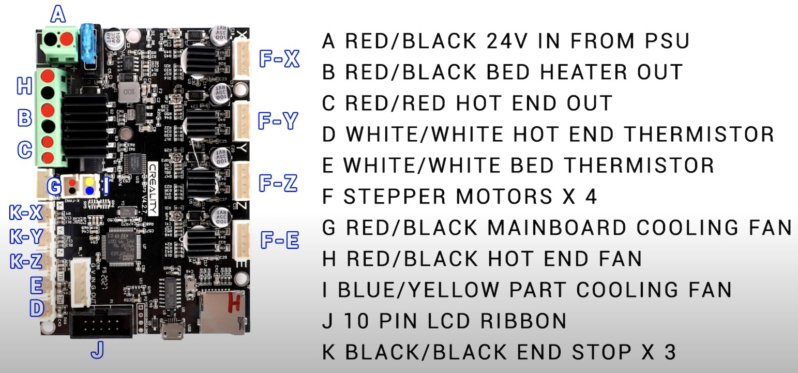

# CR-10 firmware for the Creality board v4.2.7
This project provides an already compiled, ready to flash firmware for the silent mainboard v4.2.7 with TMC2208 stepper drivers and 32bit (STM32F103RET6) ARM processor as a replacement for the stock mainboard of the CR-10 3D-printer.

## How to
1. Replace the stock mainboard and connect all the peripherals as shown in the image 
1. Copy the firmware file **firmware-20210114-230113.bin** to a FAT32-formatted micro SD-card
1. Make sure the printer is turned off, then insert the SD-card with the firmware, then turn the printer on
1. After a while, the boot screen will show up. If you get a warning about eeprom version error, select "ignore" or try to initialize it. This will only happen once